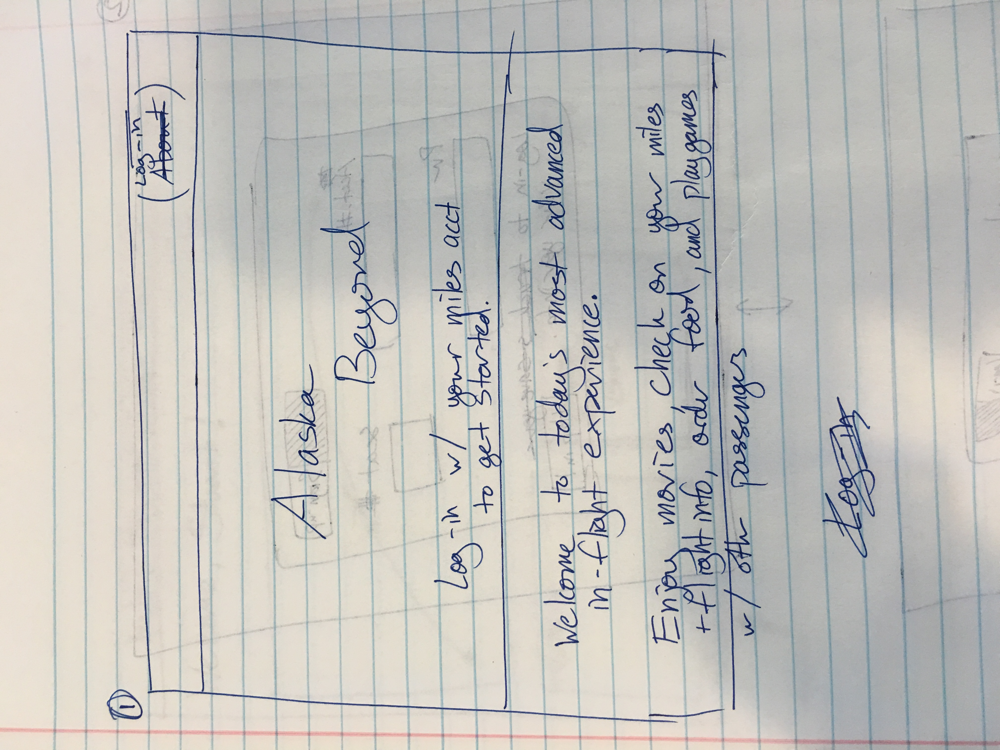
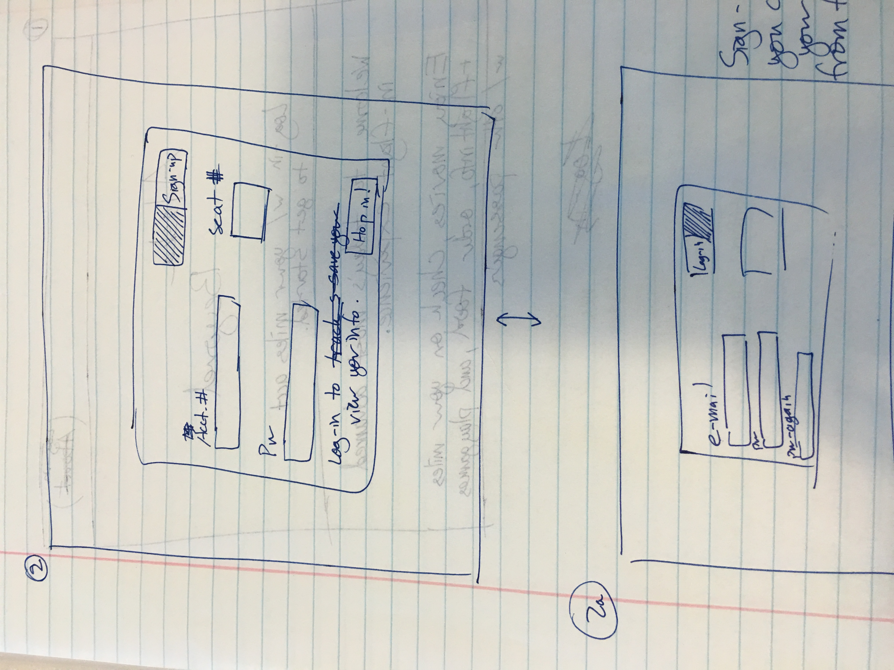
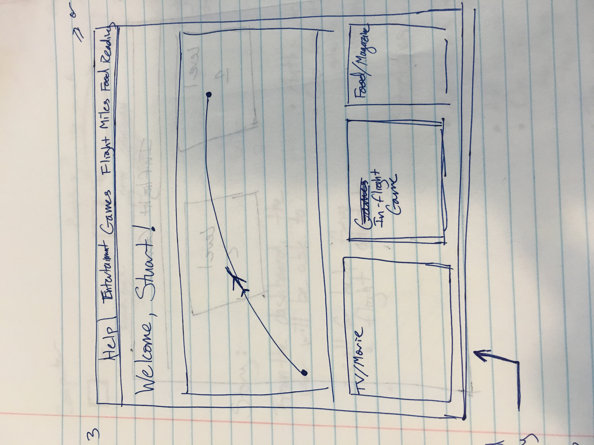
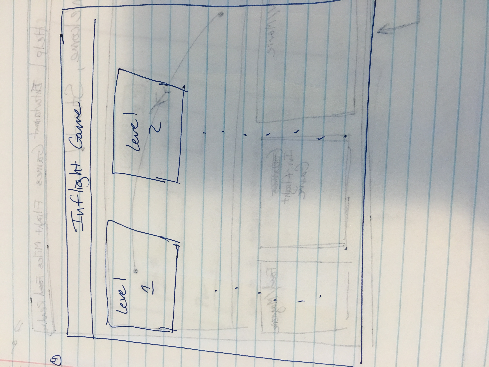
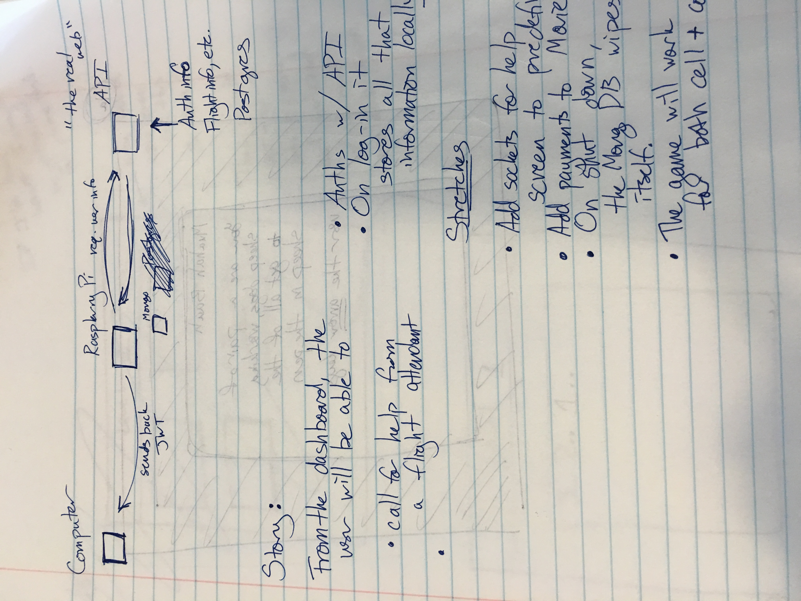
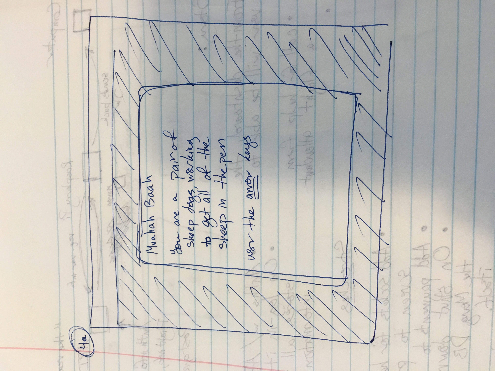
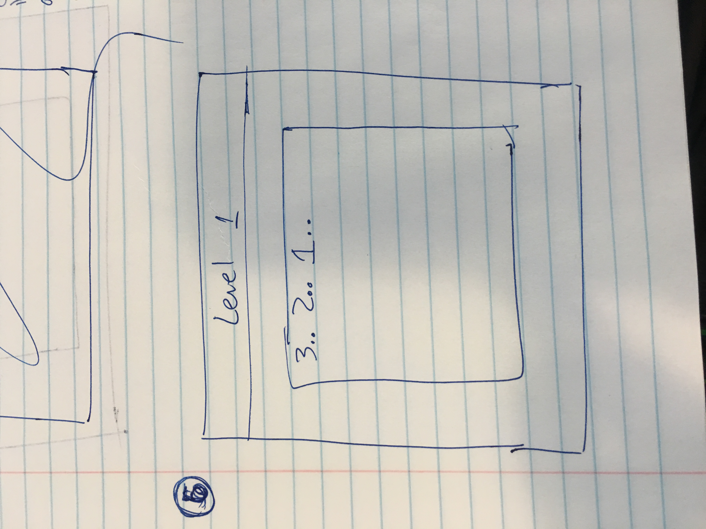
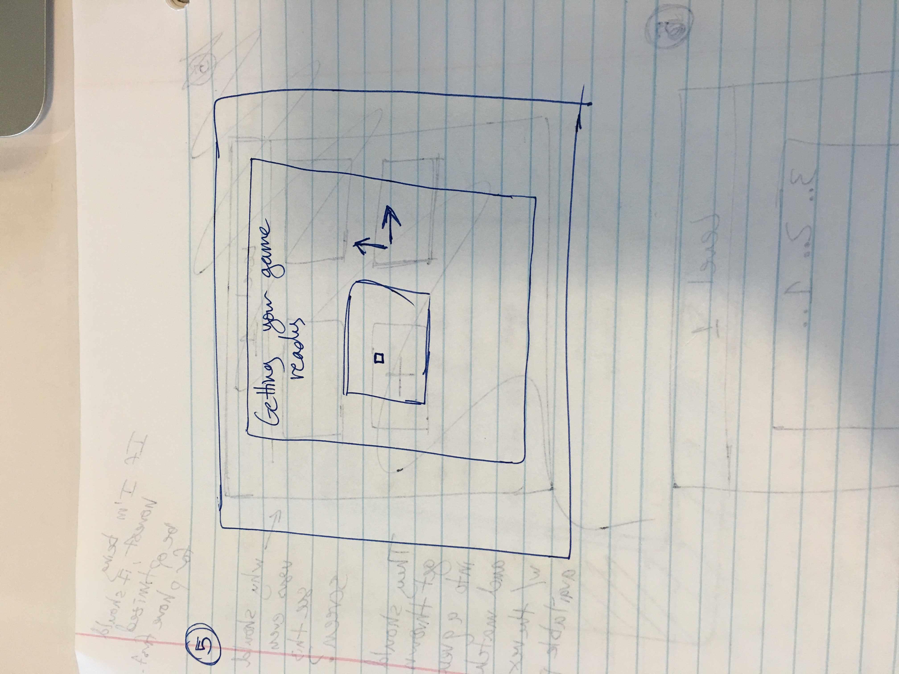
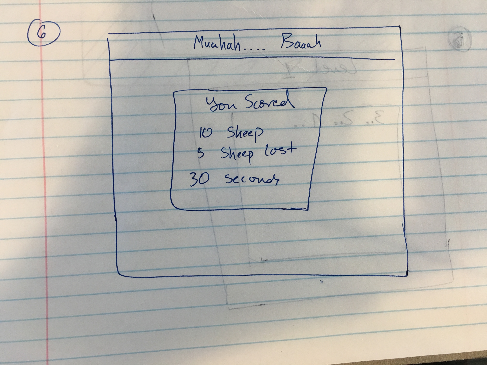

# Codename Aviator

## Problem:

  Flying on an airplane is a terrible, anti-social experience.  I want to use my skills to create a web-portal where users can play games and interact with one another in a positive way.  

## Goal:

  Create a better web portal experience for passengers in the cloud.  I will host a node server on a Raspberry Pi which users can interact with to address their needs.  The majority of the portal will be a mockup, however, there will be a multiplayer game which will use sockets to allow users to play a cooperative game with one another.

## Technology:

### Core:
	- Phaser
	- Raspberry Pi
	- React
	- Mongo
	- Express/Node
  - Mdl Lite

###Stretch:
	- Karma
	- Postgres on a second API that Pi hits
  - Webpack
  - Redux

##Stretch:  

  I want this to be completely test driven and continuous integration.  I'm going to use a combination of webpack and mocha/chai to run the tests.

##Further Details:

  The project is being managed through pivotal.  
  https://www.pivotaltracker.com/n/projects/1563523

##Mockups Below:

